# 🎧 Tune Manager

**Tune Manager** — це веб-додаток для керування музичними треками, створений як тестове завдання для відбору на курс **Genesis Frontend**.

---

## 🔑 Основні можливості

- 🔍 Пошук треків за назвою, артистом і жанром
- 🎶 Створення, редагування, видалення треків
- 📤 Завантаження/заміна аудіофайлів
- ▶️ Кастомний аудіоплеєр з контролем гучності, перемоткою, чергою відтворення
- 📱 Повна адаптивність (десктоп/мобільні пристрої)
- 📂 Пагінація списку треків
- 🖼️ Fallback-зображення при відсутності обкладинки

---

## ⚙️ Технології

- **React + TypeScript**
- `react-player` — для відтворення аудіо
- React Context API — глобальний стан плеєра
- React router - маршрутизація
- SCSS Modules

---

## 📁 Робота з аудіофайлами

У поточній версії функціонал завантаження, оновлення та видалення аудіофайлів (`audioFile`) реалізовано **локально**.

> Якщо у вас є бекенд із відповідними ендпоінтами — розкоментуйте рядки з `TrackService.uploadTrackFile` та `TrackService.removeAudioFile` у коді, щоб увімкнути повноцінну інтеграцію.

---

## 🖼️ Інтерфейс

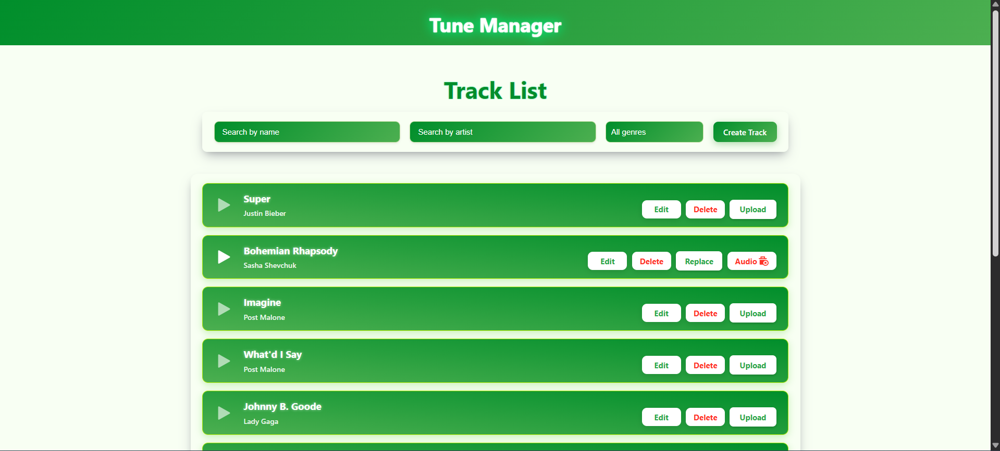

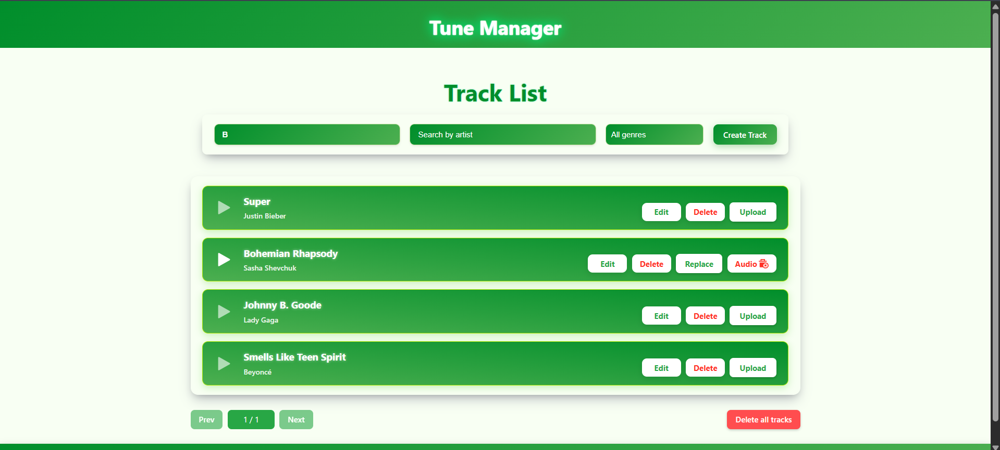

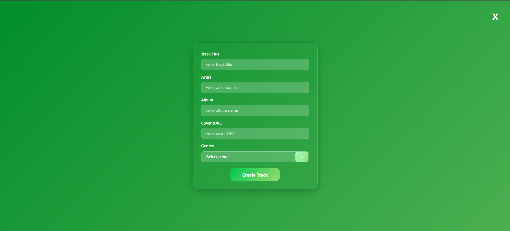

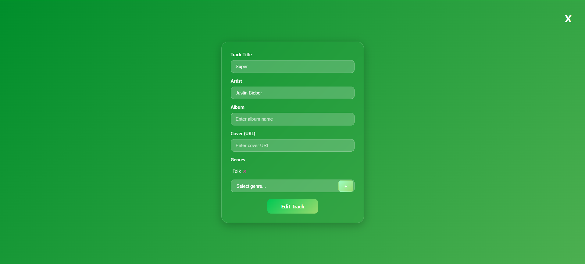

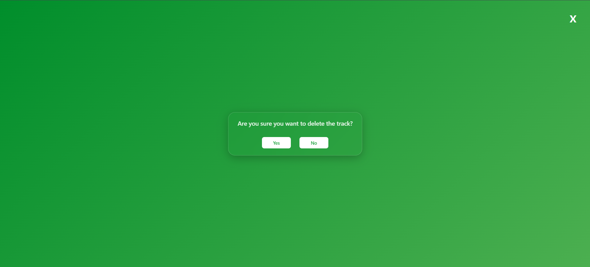

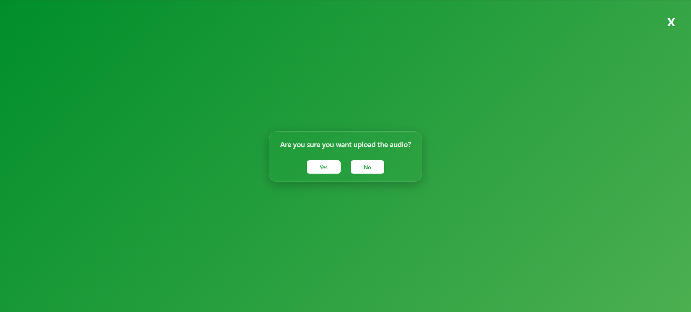

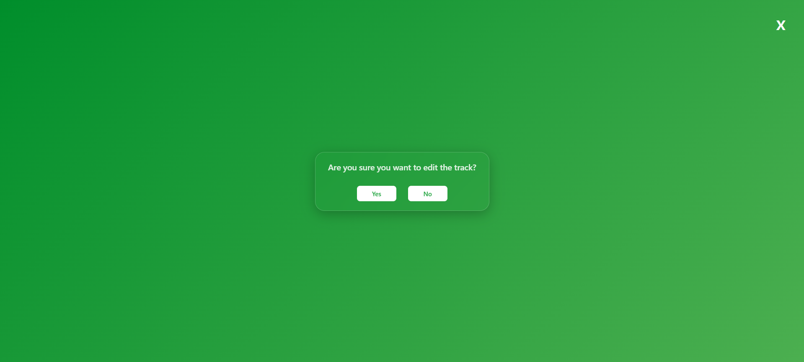

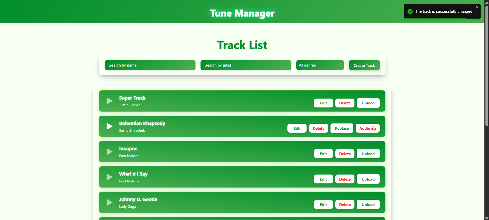

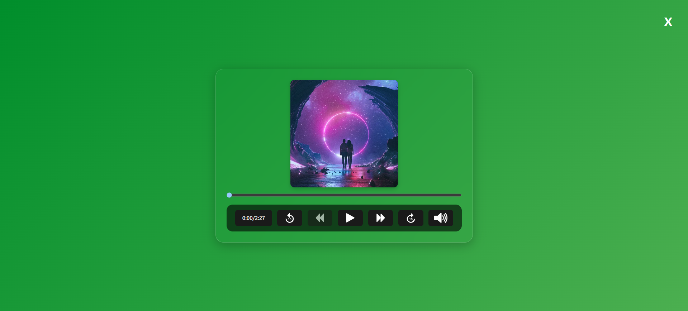

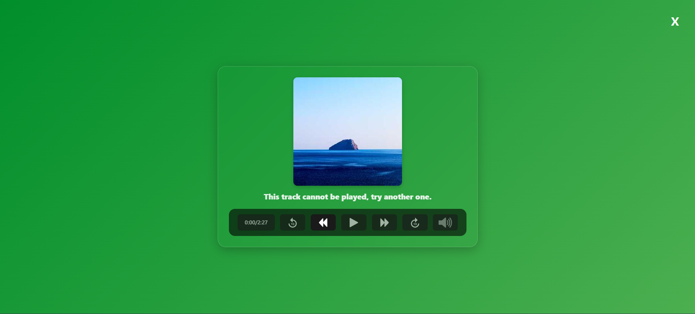

**Планшети / Телефони**

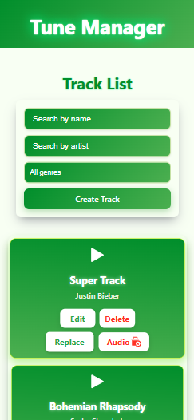

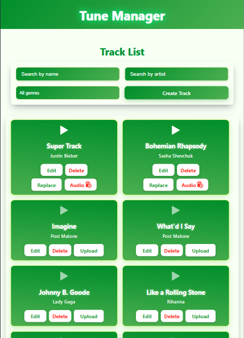

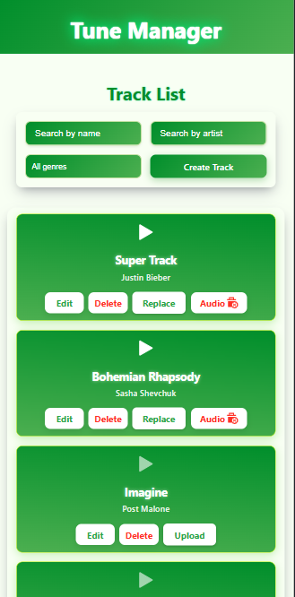